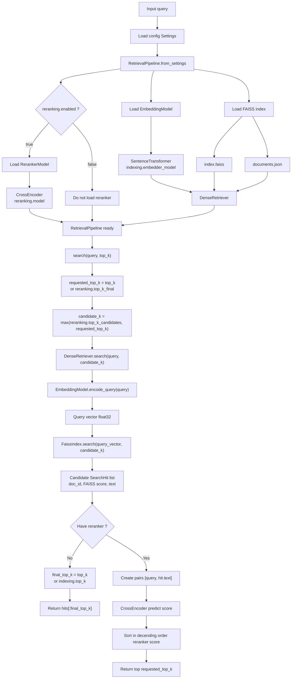

# Retrieval Pipeline

- `sentence-transformers/all-MiniLM-L6-v2` to create embedding
- FAISS CPU use for indexing and dense retrieval
- `cross-encoder/ms-marco-MiniLM-L6-v2` to rerank the results
- Dataset in `cranfield-dataset/`

## Overall pipeline



## Run

### 1. Build FAISS index

```powershell
$env:PYTHONPATH="src"
python -m retrieval_pipeline.cli.build_index --config configs/base.json
```

After the process is complete, index folder will have:

- `index.faiss`
- `documents.json`

### 2. Test query

```powershell
$env:PYTHONPATH="src"
python -m retrieval_pipeline.cli.search --config configs/base.json --query "shock wave boundary layer interaction"
```

Result format:

```text
rank    doc_id    score
```

### 3. Evaluate on Cranfield

Metric `precision@k`, `recall@k`, `map@k`, `ndcg@k`
with the default top-k = `10` (can adjust with `--top-k` flag)

```powershell
$env:PYTHONPATH="src"
python -m retrieval_pipeline.cli.evaluate --config configs/base.json
```

```powershell
$env:PYTHONPATH="src"
python -m retrieval_pipeline.cli.evaluate --config configs/base.json --top-k 10
```