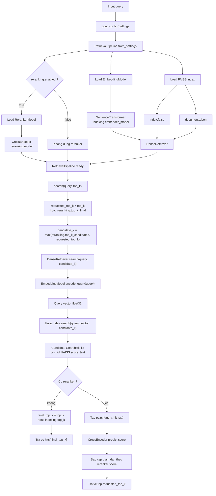

# Retrieval Pipeline

- `sentence-transformers/all-MiniLM-L6-v2` to create embedding
- FAISS CPU use for indexing and dense retrieval
- `cross-encoder/ms-marco-MiniLM-L6-v2` to rerank the results
- Dataset in `cranfield-dataset/`


## Retriever pipeline 

Pipeline truy van duoc cai dat trong `src/retrieval_pipeline/retrieval/pipeline.py`.
Khi chay lenh `search` hoac `evaluate`, chuong trinh se tao
`RetrievalPipeline` bang `RetrievalPipeline.from_settings(settings)`, sau do goi
`pipeline.search(query, top_k)`.

### So do tong quan



### Chi tiet cac buoc

1. Khoi tao model va index

   - `EmbeddingModel` load model tu `indexing.embedder_model`.
   - `FaissIndex.load(...)` doc `index.faiss` va `documents.json` trong
     `paths.index_dir`.
   - `DenseRetriever` ket hop embedder va FAISS index.
   - Neu `reranking.enabled = true`, `RerankerModel` load CrossEncoder tu
     `reranking.model`.

2. Lay so luong ket qua can tra ve

   Trong `RetrievalPipeline.search(query, top_k)`:

   - Neu CLI truyen `top_k`, pipeline dung gia tri do lam `requested_top_k`.
   - Neu khong truyen `top_k`, pipeline dung `reranking.top_k_final`.
   - So ung vien lay tu FAISS la:

     ```python
     candidate_k = max(reranking.top_k_candidates, requested_top_k)
     ```

   Voi `configs/base.json` hien tai, mac dinh se lay `100` ung vien tu FAISS
   va tra ve `10` ket qua cuoi sau rerank.

3. Dense retrieval bang FAISS

   - Query duoc encode thanh vector qua `EmbeddingModel.encode_query(query)`.
   - Vector query duoc dua vao `FaissIndex.search(...)`.
   - Neu `faiss_metric = "cosine"`, index dung `faiss.IndexFlatIP`.
   - Moi ket qua FAISS duoc dong goi thanh `SearchHit` gom:
     `doc_id`, `score`, `text`.

4. Nhanh khong rerank

   Neu `reranking.enabled = false`, pipeline khong tinh diem CrossEncoder.
   Ket qua cuoi la danh sach FAISS bi cat theo:

   ```python
   final_top_k = top_k if top_k is not None else indexing.top_k
   ```

5. Nhanh co rerank

   Neu `reranking.enabled = true`, pipeline dua tung cap `[query, hit.text]`
   vao CrossEncoder. Diem FAISS ban dau duoc thay bang diem reranker, sau do
   sap xep giam dan va tra ve `requested_top_k` ket qua tot nhat.

## Cach chay toan bo pipeline

Moi lan chay command ben duoi, hay dung o thu muc root cua project va dam bao da activate `cs419`.

### 1. Build FAISS index

Lenh nay se:

- doc toan bo document trong `cranfield-dataset/DOCS`
- encode document thanh vector
- tao FAISS index theo logic trong `src/retrieval_pipeline/indexing/faiss_index.py`
- luu ket qua vao thu muc `artifacts/indexes/cranfield_minilm`

```powershell
$env:PYTHONPATH="src"
python -m retrieval_pipeline.cli.build_index --config configs/base.json
```

Sau khi chay xong, thu muc index se co:

- `index.faiss`
- `documents.json`

### 2. Chay test query

Lenh search se:

- load embedder
- load FAISS index da build
- retrieve top candidate tu FAISS
- rerank lai neu `reranking.enabled = true`

Vi du:

```powershell
$env:PYTHONPATH="src"
python -m retrieval_pipeline.cli.search --config configs/base.json --query "shock wave boundary layer interaction"
```

Ket qua in ra theo format:

```text
rank    doc_id    score
```

Vi du:

```text
1   345   9.0768
2   256   8.7132
3   335   8.6944
...
```

### 3. Evaluate tren Cranfield

Lenh evaluate se:

- doc query tu `cranfield-dataset/query.txt`
- doc qrels tu `cranfield-dataset/REL`
- chay retrieval cho tung query
- tinh cac metric `precision@k`, `recall@k`, `map@k`, `ndcg@k`

Chay voi cutoff mac dinh `10`:

```powershell
$env:PYTHONPATH="src"
python -m retrieval_pipeline.cli.evaluate --config configs/base.json
```

Hoac chi dinh `top-k`:

```powershell
$env:PYTHONPATH="src"
python -m retrieval_pipeline.cli.evaluate --config configs/base.json --top-k 10
```

## Luong chay chuan

Khi can chay lai toan bo pipeline, thu tu nen la:

1. Activate moi truong `cs419`
2. Kiem tra hoac chinh `configs/base.json`
3. Build lai FAISS index
4. Chay `search` de test query
5. Chay `evaluate` de do chat luong toan bo tap query

## Goi gon cac lenh can dung

```powershell
.\cs419\Scripts\Activate.ps1
$env:PYTHONPATH="src"
python -m retrieval_pipeline.cli.build_index --config configs/base.json
python -m retrieval_pipeline.cli.search --config configs/base.json --query "shock wave boundary layer interaction"
python -m retrieval_pipeline.cli.evaluate --config configs/base.json --top-k 10
```

## Luu y thuong gap

- Lan chay dau co the cham vi model se duoc tai tu Hugging Face.
- Neu khong co Internet, build/search co the loi neu model chua duoc cache local.
- Tren Windows co the xuat hien canh bao `symlink` tu Hugging Face cache; day la canh bao, khong phai loi.
- Neu bo qua `python -m pip install -e .`, ban van nen giu `$env:PYTHONPATH="src"` de Python import duoc package trong thu muc `src`.

## Doi sang model finetuned sau nay

Trong `configs/base.json`, ban co the thay model tu Hugging Face sang checkpoint local.

Vi du voi embedder:

```json
"embedder_model": "artifacts/models/my-finetuned-embedder"
```

Vi du voi reranker:

```json
"model": "artifacts/models/my-finetuned-reranker"
```

Mien la checkpoint tuong thich voi `SentenceTransformer` hoac `CrossEncoder`, cac lenh chay pipeline phia tren khong can doi.
